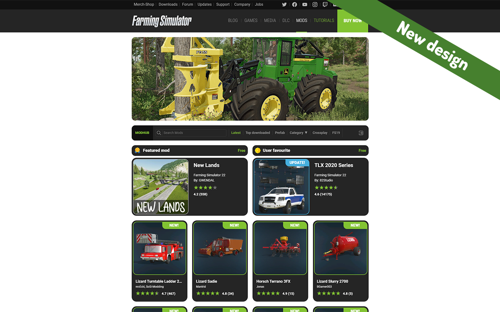
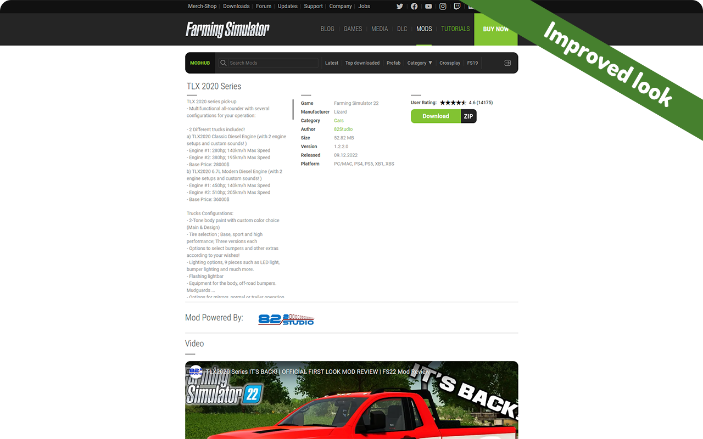
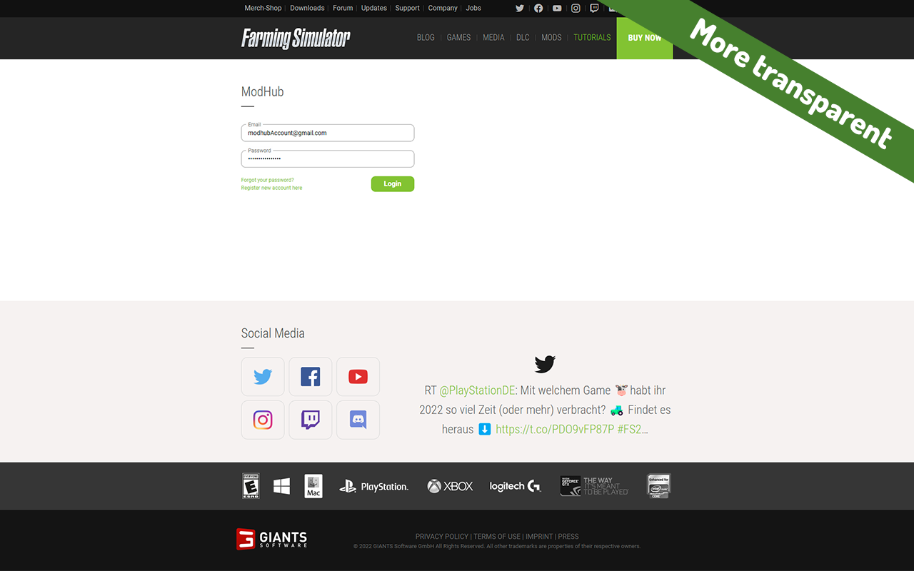
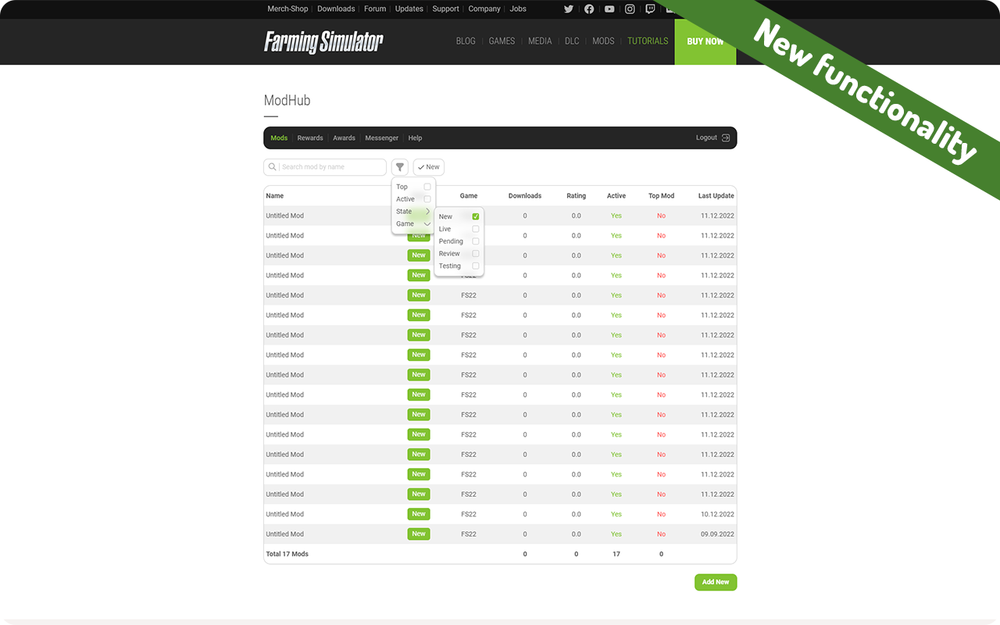

<div id='top'></div>
<br/>
<div align='center'>
    <a href='https://github.com/4c65736975/Modhub-2.0'>
        
    </a>
    <h3>Modhub 2.0</h3>
    <p>
        An Chrome/Edge extension to improve and add new functionality for modhub.
        <br />
        <br />
        <a href='https://github.com/4c65736975/Modhub-2.0/issues'>Report Bug</a>
        ·
        <a href='https://github.com/4c65736975/Modhub-2.0/issues'>Request Feature</a>
    </p>
</div>
<details>
    <summary>Table of Contents</summary>
    <ol>
        <li>
            <a href="#about-the-project">About The Project</a>
            <ul>
                <li>
                    <a href="#built-with">Built With</a>
                </li>
            </ul>
        </li>
        <li>
            <a href="#getting-started">Getting Started</a>
            <ul>
                <li>
                    <a href="#prerequisites">Prerequisites</a>
                </li>
                <li>
                    <a href="#installation">Installation</a>
                </li>
            </ul>
        </li>
        <li>
            <a href="#usage">Usage</a>
        </li>
        <li>
            <a href="#license">License</a>
        </li>
        <li>
            <a href="#acknowledgments">Acknowledgments</a>
        </li>
    </ol>
</details>

## About the project



As a farming simulator modmaker, I often use the [modhub](https://www.farming-simulator.com/mods.php?lang=pl&country=pl) site. I have become very bored with the look of it. I also missed the ability to filter the modifications I sent so that, for example, I could hide modifications from the previous version of the game. That's why I decided to make a browser extension that will change the appearance of [modhub](https://www.farming-simulator.com/mods.php?lang=pl&country=pl) and add missing functionality. If you feel that you are bored of look of this site or you want filtering and searching features like me. Then this extension is perfect for you. Hope you will like it and let me know what I should change or improve :upside_down_face:

**Features:**
* More modern design
* Filtering uploaded mods by eg. game version, mod state
* Searching uploaded mods by name

Don't forget to give the project a star! Thanks again!

<p align="right">&#x2191 <a href="#top">back to top</a></p>

### Built With

* [HTML5](https://www.w3.org/Style/CSS/Overview.en.html)
* [CSS](https://html.com/)
* [Javascript](https://www.javascript.com/)

<p align="right">&#x2191 <a href="#top">back to top</a></p>

## Getting started

If you want to install latest official version, you can download it like other extensions.
<br/>
Here you have direct link [Modhub 2.0 (Edge)](https://microsoftedge.microsoft.com/addons/Microsoft-Edge-Extensions-Home) .

### Prerequisites

* [Microsoft Edge](https://www.microsoft.com/pl-pl/edge/home?form=MA13FJ) / [Chrome](https://www.google.com/intl/pl_pl/chrome/)

### Installation

1. Clone the repo
```sh
git clone https://github.com/4c65736975/Modhub-2.0
```
2. Go to [Edge extensions](edge://extensions/) / [Chrome extensions](chrome://extensions/)
3. Turn on developer mode
4. Click 'Load unpacked' and select extension folder
5. Copy ID of loaded extension
6. Change '--extension-id--' from all extension files to copied ID

<p align="right">&#x2191 <a href="#top">back to top</a></p>

## Usage





<p align="right">&#x2191 <a href="#top">back to top</a></p>

## License

Distributed under the GPL-3.0 license. See [LICENSE.md](https://github.com/4c65736975/Modhub-2.0/blob/main/LICENSE.md) for more information.

<p align="right">&#x2191 <a href="#top">back to top</a></p>

## Acknowledgments

* [Choose an Open Source License](https://choosealicense.com)
* [Best README Template](https://github.com/othneildrew/Best-README-Template)

<p align="right">&#x2191 <a href="#top">back to top</a></p>